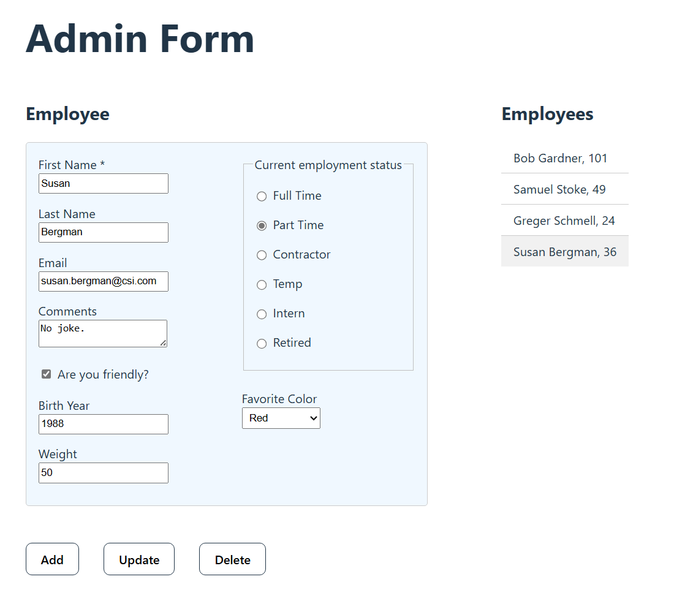

# React Form interacting with localstorage

## Description
This is a CRUD (Create, Read, Update, Delete) application with a React client, using localstorage for storing data. 

The same client, but with an ASP.NET API and SQL Server backend is found <a href="https://github.com/qserena/react-aspnet/">Here!</a> 
  
  
  
<kbd></kbd>

The form shown above is used to execute the CRUD operations. I included quite a lot of input fields in order to handle many data types. 

The React app includes the following techniques:
- [Controlled inputs](https://react.dev/reference/react-dom/components/input#controlling-an-input-with-a-state-variable) for good practice on how to handle form data.
- [Axios package](https://axios-http.com/) to make http requests to the Web API.

When using "Update" and "Delete" you have to first select the item in the list at the right.

## Technologies
- HTML
- CSS
- JavaScript
- React

## Live link
The React Form is deployed here:
[https://toms-employees.netlify.app](https://toms-employees.netlify.app)

Please feel free to visit and try out the form!

